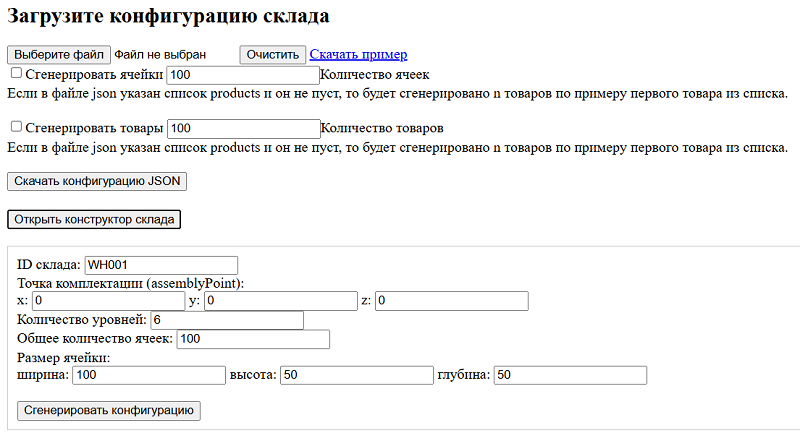
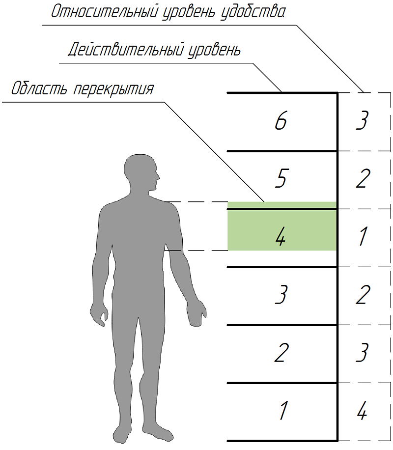
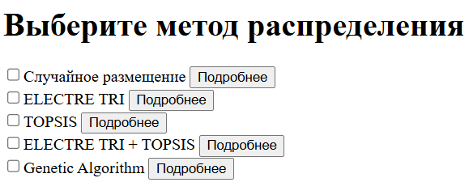
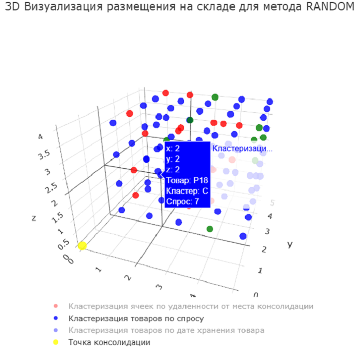
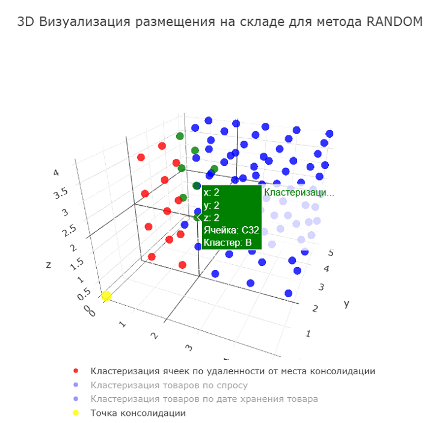
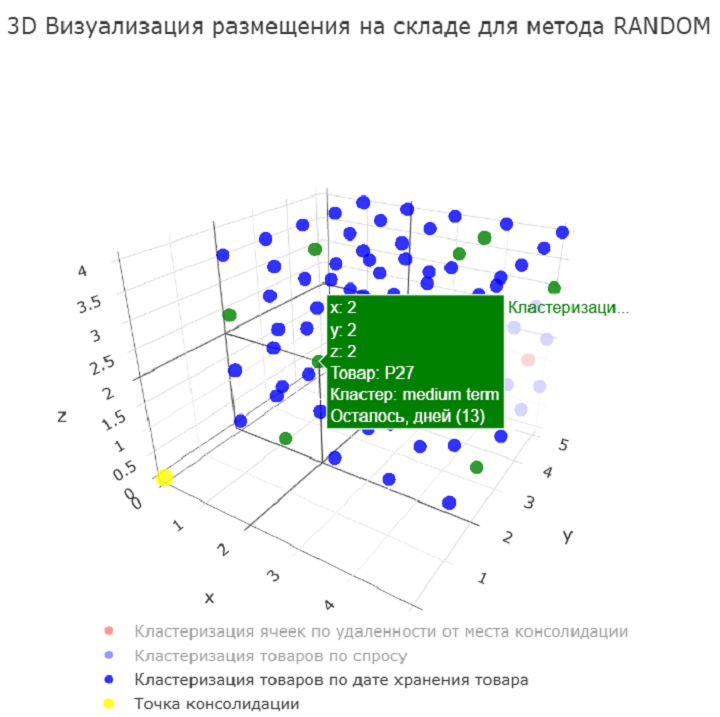
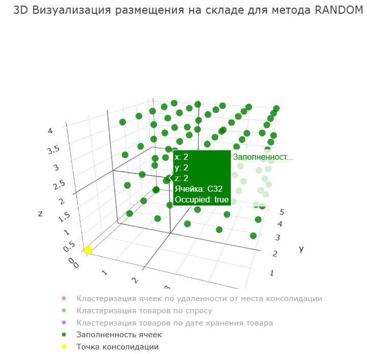

# Smart Storage Assignment System

Веб-приложение для моделирования и визуализации планов размещения товаров на складе (решение задачи SLAP).

## SLAP

SLAP (Storage Location Assignment Problem) - задача оптимизации размещения. Представляет собой многокритериальную
задачу, решение которой напрямую влияет
на скорость и эффективность складских операций. Идея заключается в нахождении наиболее оптимального и удобного во всех
смыслах места для какого-нибудь объекта.

## Использование

### Конструктор склада

Сначала пользователю предлагается сгенерировать конфигурацию склада или написать ее самостоятельно в формате json,
воспользовавшись [примером](src/main/resources/static/warehouse_ex.json).
Также конфигурацию можно загрузить через файл если она была создана ранее.
Если в конфигурации не задано множество товаров и ячеек - их можно сгенерировать также
в конструкторе [(рис. 1)](#fig1).

*Рис. 1 – Конфигурация склада на стороне клиента*

[//]: # ()

## Целевая функция

Для оптимизации размещения рассчитывается целевая функция по каждой паре товар-ячейка.

$$
C_{cell, product} = p_{\text{demand}} \cdot p_{\text{distance}} \cdot k \cdot p_{\text{relativeLevel}} / d_
{\text{remained}},
$$

где:
- $p_{\text{demand}}$ – уровень спроса на товар,
- $p_{\text{distance}}$ – расстояние от ячейки до точки консолидации,
- $k$ – весовой коэффициент для учета относительного уровня (в зависимости от весогабаритных свойств груза, уровнем
  относительного удобства может быть неодинаков),
- $p_{\text{relativeLevel}}$ – относительный уровень удобства расположения товара,
- $d_{\text{remained}}$ – остаток места хранения в ячейке.

Относительный уровень удобства доступа к ячейке рассчитывается на основании средней высоты человека и высоты ячейки. Чем
больше высота перекрытия того или иного уровня в промежутке между уровнем плеча и солнечного сплетения – тем более
предпочтительным оказывается уровень. Остальным присваивается значение на 1 меньше от соседа с более высоким
рангом [рис. 2](#fig2).

*Рис. 2 – Принцип действия относительных уровней*

## Алгоритмы распределения

Ниже перечислены алгоритмы которые пользователь может использовать для решения задачи SLAP:

- ELECTRE TRI
- TOPSIS
- Генетический алгоритм
- Комбинация: ELECTRE TRI + TOPSIS
- Случайное распределение

Случайное размещение можно использовать как базис относительно которого сравниваются другие алгоритмы.
Все перечисленные выше методы можно выбрать как отдельно, так и совместно [(рис. 3)](#fig3). В конечном итоге, будет
составлено
по одному плану размещения для каждого выбранного алгоритма.

*Рис. 3 – Методы распределения на стороне клиента*

### Визуализация

После получения сформировнных планов размещения - их можно скачать json файлом. Также сервис формирует на странице
3d-сцены с указанной конфигурацией склада, где соответствующей ячейке присваивается определенный товар.

Так каждая ячейка отображается в координатной системе (X, Y, Z). На сцене помимо ячеек и товаров указано положение
предполагаемой точки консолидации.

Для большего удобства реализована цветовая маркировка. Товары и ячейки разбиваются на кластеры и помечаются
соответствующим цветом:

- по спросу (товары) [(рис. 4)](#fig4)
- по удаленности от точки консолидации (ячейки) [(рис. 5)](#fig5)
- по срокам хранения (товары) [(рис. 6)](#fig6)
- по занятости (ячейки) [(рис. 7)](#fig7)

 
*Рис. 4 – Сцена с визуализацией решения при помощи библиотеки Plotly.js на стороне клиента. Кластеризация по спросу
товара*

 
*Рис. 5 – Сцена с визуализацией решения при помощи библиотеки Plotly.js на стороне клиента. Кластеризация по удаленности
ячеек*

 
*Рис. 6 – Сцена с визуализацией решения при помощи библиотеки Plotly.js на стороне клиента. Кластеризация по срокам
хранения товара*

 
*Рис. 7 – Сцена с визуализацией решения при помощи библиотеки Plotly.js на стороне клиента. Занятость ячеек*

### Сторонние библиотеки

This project uses the following open-source libraries:

- [Plotly.js](https://github.com/plotly/plotly.js) — MIT License
- [Bootstrap](https://github.com/twbs/bootstrap) — MIT License

## License

This project is licensed under the **Apache License 2.0**.  
You may freely use, modify, and distribute it, provided that you comply with the license terms.

See the [LICENSE](./LICENSE) file for the full text.

  
  